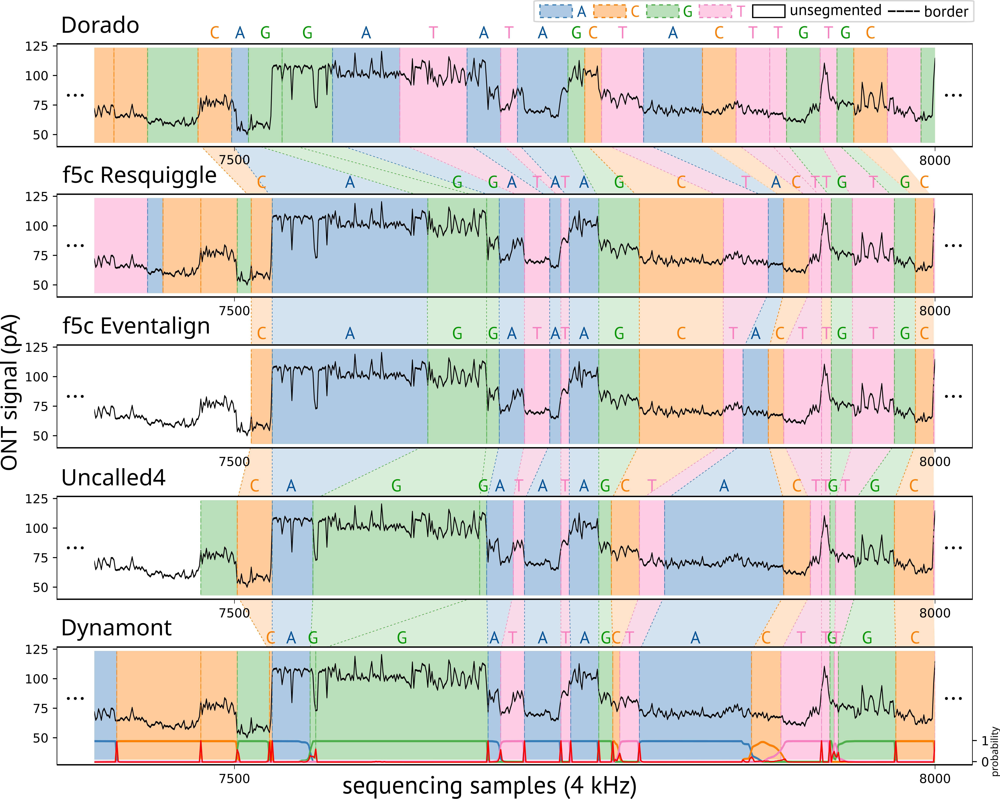
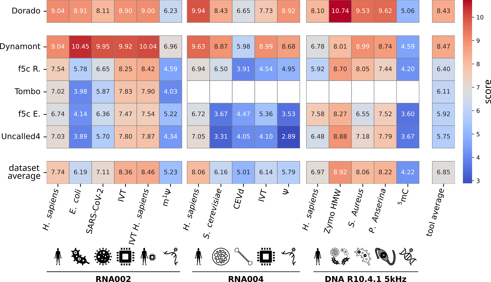
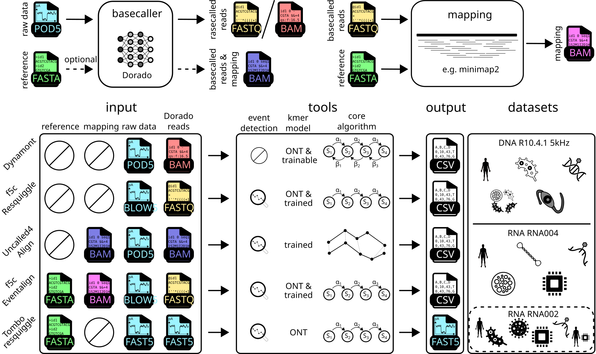

A **Dynam**ic Programming Approach to Segment **ONT** Signals. 
Dynamont is a segmentation/resquiggling tool for ONT signals.
Dynamont was tested on
* RNA002
* RNA004
* DNA R10.4.1 5kHz (I applied the trained transition parameters from the RNA004 model to the DNA R10 models. These should be fine-tuned for the DNA models.)


[](https://www.gnu.org/licenses/gpl-3.0)
[ ](https://pypi.org/project/dynamont/)

Please cite [10.1093/gigascience/giag005](https://doi.org/10.1093/gigascience/giag005). [](https://juleskreuer.eu/citation-badge/)

---

- [Segmentation Comparison](#segmentation-comparison)
- [Installation](#installation)
  - [Pypi/pip](#pypipip)
- [Usage](#usage)
- [Default models:](#default-models)
- [Output](#output)
  - [Example Output](#example-output)
- [Exit-Codes](#exit-codes)

---

# Segmentation Comparison

For further details please read: [10.1093/gigascience/giag005](https://doi.org/10.1093/gigascience/giag005)

<!--  -->



# Installation

## Pypi/pip

Recommendation: use `uv`
```bash
uv venv path/to/venv/dynamont
source path/to/venv/dynamont/bin/activate
uv pip install dynamont
```

# Usage

```bash
# segment a dataset
dynamont-resquiggle -r <path/to/pod5/dataset/> -b <basecalls.bam> --mode basic -o <output.csv> -p <pore>

# train model
dynamont-train -r <path/to/pod5/dataset/> -b <basecalls.bam> --mode basic -o <output/path> -p <pore>

# choosing a pore will automatically load the default model for that pore, a custom model can be used with the parameter --pore_model <model/path>
```

# Default models:

- [rna002](models/rna/rna002/rna002_5mer.model) (tested)
- [rna004](models/rna/rna004/rna004_9mer.model) (tested)
- dna_r9 not available
- [dna_r10.4.1 260 bps](models/dna/r10.4.1/dna_r10.4.1_e8.2_260bps.model) (not tested)
- [dna_r10.4.1 400 bps](models/dna/r10.4.1/dna_r10.4.1_e8.2_400bps.model) (tested)

# Output

Dynamont produces a tabular output with the following columns:  

| Column Name             | Description |
|-------------------------|-------------|
| **readid**             | Unique identifier for the read. |
| **signalid**           | Identifier for the signal corresponding to the read. |
| **start**              | Start position of the signal segment in the read. |
| **end**                | End position of the signal segment in the read. |
| **basepos**            | Base position in the read. |
| **base**               | The detected base at this position. |
| **motif**              | The surrounding sequence motif in which the base appears. |
| **state**              | The methylation state (or modification state) of the base. |
| **posterior_probability** | Probability assigned to the predicted segment. |
| **polish**             | Polished kmer, only available in resquiggle mode. |

## Example Output  

Below is an example of the output generated by Dynamont:  

```csv
readid,signalid,start,end,basepos,base,motif,state,posterior_probability,polish
476b4ed2-7865-4f81-9f78-82d614fb40a2,476b4ed2-7865-4f81-9f78-82d614fb40a2,12762,12777,53,A,AAAAAAAAA,M,0.12434,NA
476b4ed2-7865-4f81-9f78-82d614fb40a2,476b4ed2-7865-4f81-9f78-82d614fb40a2,12777,12791,52,A,AAAAAAAAA,M,0.12146,NA
476b4ed2-7865-4f81-9f78-82d614fb40a2,476b4ed2-7865-4f81-9f78-82d614fb40a2,12791,12806,51,A,AAAAAAAAA,M,0.11881,NA
476b4ed2-7865-4f81-9f78-82d614fb40a2,476b4ed2-7865-4f81-9f78-82d614fb40a2,12806,12820,50,A,AAAAAAAAA,M,0.11665,NA
```

## Differences Segmentation Tools

